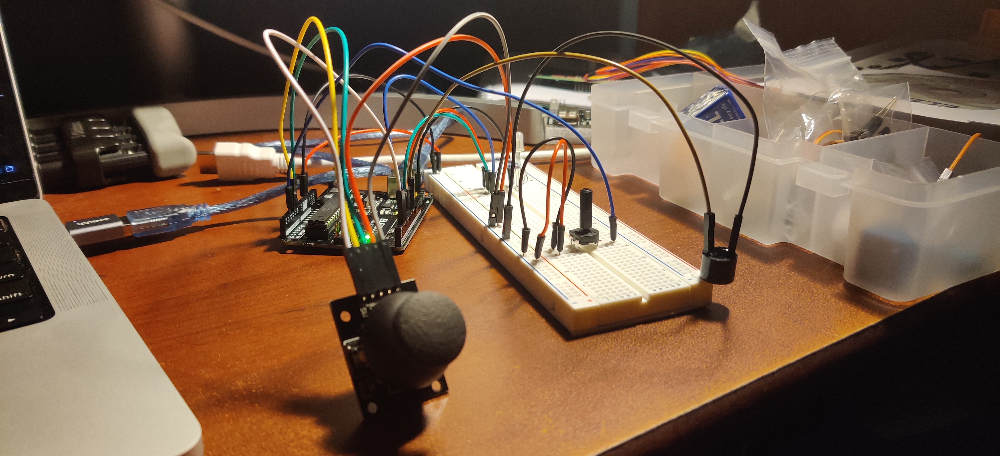

# JoyTone 🕹️🎶💡

  

## Overview
This project is an interactive Arduino-based system that uses a joystick and potentiometer to control an RGB LED and an active buzzer. The system allows users to:

- Select colors and adjust brightness using the joystick and potentiometer.

- Play a customizable melody with tempo control via the potentiometer.

- 🎥 Watch my [**Video Demo**](https://youtu.be/RiVcEHe66-4?si=naWTUt-6H5cJfZ4Z&t=191).

## Background
- JoyTone was undertaken as part of my [Mobile & Ubiquitous Computing](https://omscs.gatech.edu/cs-7470-mobile-ubiquitous-computing) course at [Georgia Tech](https://omscs.gatech.edu/) 🐝.
- I utilized an Uno R3 [starter kit from Elegoo](https://www.amazon.com/ELEGOO-Project-Tutorial-Controller-Projects/dp/B01D8KOZF4?sr=8-3).

- 📝 View my [**Full Report**](https://docs.google.com/document/d/19XJWGTsRkrTJIB22Q7OTL0zSMG7qXp_5Vg1iT8K4lJA/edit?usp=sharing).

## Features
- Joystick-Controlled RGB LED:

  - Left: Pure blue

  - Pure red

  - Pure green

  - Down: Color rotation (cycles through red, green, and blue)

  - Neutral (Center): Turns off the LED

- Potentiometer-Controlled Brightness:

  - Adjusts the brightness of the RGB LED by scaling the PWM signal.

- Customizable Melody Playback:

  - 🥳 Plays the "Happy Birthday" melody on the buzzer when the joystick button is pressed.

  - Tempo of the melody is controlled by the potentiometer (50% to 200% of the original speed).
